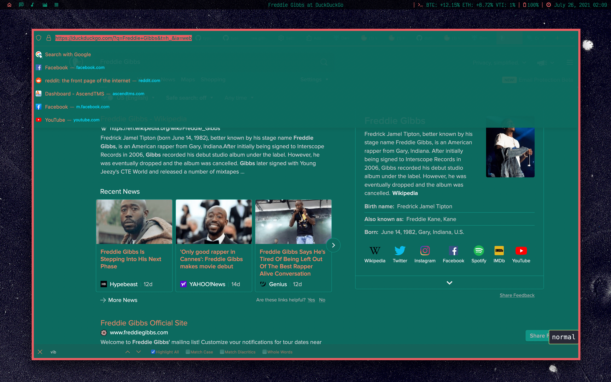

# F L Y E R F O X

_An oneline userChrome.css theme for Firefox, which aims to keep the Proton experience._





## Features


## Installation

1. In the searchbar, type `about:config`. A dialog will be shown to you. Press the **I accept the risk** button.
2. Search for **`toolkit.legacyUserProfileCustomizations.stylesheets`** and change it to **True**.
3. Go to your Firefox profile:
   - In the searchbar, type `about:support` and press `Enter`.
   - Search for **`Profile Directory`** and click on **`Open Directory`** button.
4. Create a folder and name it **`chrome`** (with lowercase).
5. Paste userChrome.css file into the folder.
6. Restart Firefox
7. Enjoy your new Firefox!


## Customization

- You can change some settings inside the userChrome.css file.
- Use `--navbarWidth` variable to change the width of the navbar (you can use px units for a fixed width, or vw units for a percentage one).
- Use `--animationSpeed` variable to change (or disable) animations.
- Hide or show the elements you want by commenting or uncommenting them:
```css
/* This element is hidden */
/* "Shield" icon */
#tracking-protection-icon-container {display: none !important}

/* This element is visible */
/* This is the "Search with" indicator on the urlbar */
/* #urlbar-search-mode-indicator {display: none !important} */
```
